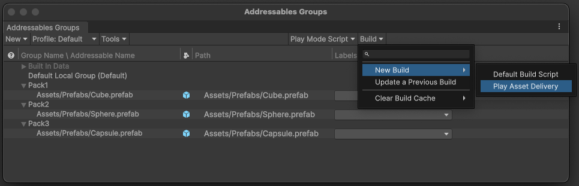

# Build Addressables content for Android

You can build Addressables content for Android with the Play Asset Delivery option only when you set the current platform to Android and set up Play Asset Delivery support. For more information on how to set up Play Asset Delivery support, refer to [Set up the Addressables for Android package](install.md#android-addressables).

You can build Addressables content with the Player build or you can build it separately.

>[!NOTE]
>The [Play Asset Delivery schema](play-asset-delivery-schema-reference.md) added to Addressables groups doesn't affect other platforms.

## Build Addressables content before the Player build

To build Addressables content, open the **Addressables Groups** window and go to **Build > New Build**. Then select **Play Asset Delivery** to run the **Play Asset Delivery** Addressables build script.

  _Play Asset Delivery_

After building Addressables content, you can build the Player.

Unity generates Android asset packs when [Android App Bundle](https://docs.unity3d.com/6000.0/Documentation/Manual/android-distribution-google-play.html#android-app-bundle) is enabled in Android Build settings, and either the [Split Application Binary](https://docs.unity3d.com/Manual/class-PlayerSettingsAndroid.html#splitapplicationbinary) property or the [Texture Compression Targeting](https://docs.unity3d.com/6000.0/Documentation/Manual/android-distribution-google-play.html#texture-compression-targeting) is enabled in the Android Player settings.

Otherwise, built Addressables content is included in the [Streaming Assets](https://docs.unity3d.com/Manual/StreamingAssets.html).

## Build Addressables content with the Player build

When you modify the assets, you must rebuild the Addressables content before you build the Player. You can build the Addressables content along with the Player to include asset modifications if any, but the build time can be longer.

To rebuild Addressables content on Player build:
1. Open the **Addressable Asset Settings** in the Inspector window. To do this, either select the Addressable Asset Settings file in the Project window, or go to **Window > Asset Management > Addressables > Settings**.
2. Set the **Build Addressables on Player Build** property to either **Build Addressable content on Player Build** or **Use Global Settings**.

If you set **Use Global Settings** option, you must also set **Build Addressables on Player Build** option in **Addressables settings** in Unity Editor Preferences to **Build Addressable content on Player Build**. For information about this setting, refer to [Addressables Build Settings](xref:addressables-asset-settings#build).

## Settings modifications

When you build Addressables content separately or with the Player build,  certain settings undergo modifications.

For Addressable groups which have Play Asset Delivery schema:

* **Build and Load Paths** are forcefully set to **Local** in their [Content Packing & Loading schema](xref:addressables-content-packing-and-loading-schema),
* [Build Remote Catalog](xref:addressables-asset-settings#catalog) is turned off in Addressable Asset Settings,
* [Compress Textures on Import](https://docs.unity3d.com/Manual/Preferences.html#asset-pipeline) is enabled in Asset Pipeline settings in Unity Editor Preferences.

All these settings are restored right after Addressables content is built for Play Asset Delivery. This allows multi-platform support, so you can build Addressables for remote delivery for other platforms and use Play Asset Delivery functionality for Android at the same time.

Addressable groups which don't have Play Asset Delivery schema and with
* **Build and Load Paths** set to **Local** in their [Content Packing & Loading schema](xref:addressables-content-packing-and-loading-schema) are packed to the application's [Streaming Assets](https://docs.unity3d.com/Manual/StreamingAssets.html).
* **Build and Load Paths** set to **Remote** are generated in the folder for remote assets and can be hosted on the remote server.

>[!Note]
> When Addressables content is built for Play Asset Delivery, the catalog file can't be remote and is packed into `AddressablesAssetPack` even if there are no Addressable groups which should use Play Asset Delivery functionality.
