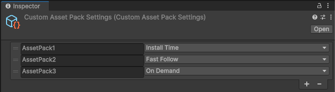

# Custom Asset Pack Settings

A custom asset pack can include more than one Addressable group. Using Custom Asset Pack Settings inspector, you can create, rename, change the Delivery Type, and delete the custom asset packs.

   _Custom Asset Pack settings_

If you delete a custom asset pack while it is being used in Play Asset Delivery schema for some Addressable groups,
* **Include In Custom Asset Pack** option in those groups automatically turns off.
* The groups inherit the **Delivery Type** of the deleted custom asset pack. This means the groups now have the same **Delivery Type** as that of the deleted custom asset pack.
