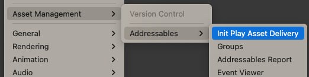
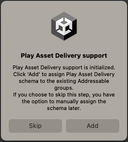

# Install Addressables for Android package

To install the Addressables for Android package in your project, use the [Unity Package Manager](https://docs.unity3d.com/Manual/Packages.html).

1. Open the **Package Manager** (menu: **Window** > **Package Manager**).
2. Set the package list to display packages from the **Unity Registry**.
3. Select the **Addressables for Android** package in the list.  **Note**: The package name is `com.unity.addressables.android` and the display name is **Addressables for Android**.
4. Click **Install**.

You can add the Addressables for Android package to your project even if no Addressables package is added before. In this case, the `com.unity.addressables` package is automatically installed along with the `com.unity.addressables.android` package.

## Set up Addressables

After both the packages are installed, before you set up Addressables for Android, you must initialize Addressables. Use the following steps to initialize and set up Addressables:

1. Go to **Window > Asset Management > Addressables > Groups** to open the **Addressables Groups** window.
2. Click **Create Addressables Settings**.

For more information on how to set up Addressables, refer to [Install Addressables](https://docs.unity3d.com/Packages/com.unity.addressables@2.3/manual/installation-guide.html).

After you set up Addressables, continue with the Addressables for Android setup.

## Set up Addressables for Android

After you install the Addressables for Android package, you can access a new menu option **Init Play Asset Delivery** under **Window> Asset Management > Addressables**.

  _Init Play Asset Delivery option_

To set up Addressables for Android, use the following steps:

1. Select **Init Play Asset Delivery** option to initialize Addressables for Android.

    When you select this option, the Addressables for Android system creates the new required script assets including **Play Asset Delivery Content template** for Addressable groups. Also, a dialog appears to assign **Play Asset Delivery schema** to the existing Addressable groups automatically.

2. Click your preferred option to either automatically assign the Play Asset Delivery schema right away or manually assign the schema later.

      _Play Asset Delivery support_

When Addressables for Android is fully set up, the **Init Play Asset Delivery** menu option is grayed out.

Unity generates Android asset packs when [Android App Bundle](https://docs.unity3d.com/6000.0/Documentation/Manual/android-distribution-google-play.html#android-app-bundle) is enabled in Android Build settings, and either the [Split Application Binary](https://docs.unity3d.com/Manual/class-PlayerSettingsAndroid.html#splitapplicationbinary) property or the [Texture Compression Targeting](https://docs.unity3d.com/6000.0/Documentation/Manual/android-distribution-google-play.html#texture-compression-targeting) is enabled in the Android Player settings.

> [!NOTE]
> * By default, Delivery Type for asset packs is set to **Fast Follow** which you can edit later.
> * Play Asset Delivery schema added to the groups affects Android builds only. Building Addressables content for other platforms is not affected.
> * A warning message is displayed if the total number of groups with Play Asset Delivery schema exceeds [**Google's limit**](https://support.google.com/googleplay/android-developer/answer/9859372?hl=en&sjid=12405437898273768905-AP#size_limits) for total number of asset packs, which is `100`. In this case, you can make some groups **Install Time** or combine some of the groups into larger asset packs using Custom Asset Packs functionality. For more information, refer to [Play Asset Delivery schema reference](play-asset-delivery-schema-reference.md).

## Additional resources

* [Custom Asset Packs](custom-asset-packs-settings.md)
* [Play Asset Delivery schema reference](play-asset-delivery-schema-reference.md)
