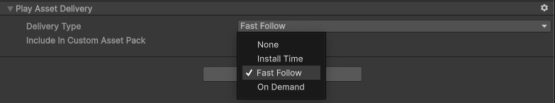
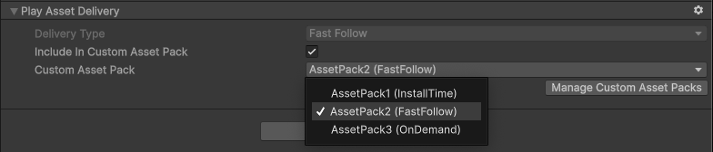

# Play Asset Delivery schema reference

Play Asset Delivery schema instructs Addressables for Android system to pack group content for Play Asset Delivery. The schema can be added automatically when you set up the Addressables for Android package. You can also add the schema manually to the existing Addressable groups. Check Play Asset Delivery Schema in the Inspector window of your project.

   _Delivery Type_

   _Custom Asset Pack_

| **Property**| **Description** |
|---|---|
| **Delivery Type**| Set up the ways to deliver Android asset packs generated from the Addressable group to the user's device. By default when building content with Play Asset Delivery support, Addressable groups are packed to separate Android asset packs which means one Addressable group per asset pack.   Delivery type can be **Install Time**, **Fast Follow**, and **On Demand**. For more information about delivery types, refer to Android documentation on [Delivery modes](https://developer.android.com/guide/playcore/asset-delivery#delivery-modes). Selecting Delivery type **None** allows you to pack the Addressable group to the application's [Streaming Assets](https://docs.unity3d.com/Manual/StreamingAssets.html). **Note:**  **Delivery Type** option is grayed out if **Include In Custom Asset Pack** is checked and **Custom Asset Pack** is selected.|
| **Include In Custom Asset Pack**| Indicate whether to include more than one Addressable group into one Android asset pack, for example, in cases where the total number of Addressables groups exceeds Google Play limit (100). When this option is enabled, - **Custom Asset Pack** drop-down appears that allows you to select a custom asset pack for the current group. - **Manage Custom Asset Packs** button appears that allows you to switch to [Custom Asset Pack Settings](custom-asset-packs-settings.md) inspector.|
| **Custom Asset Pack** | Select a custom asset pack for the current group. You must create at least one custom asset pack using the [Custom Asset Pack Settings](custom-asset-packs-settings.md) inspector. You can set the delivery type of individual custom asset packs in Custom Asset Pack settings. If no custom asset pack is selected, delivery type set using Delivery Type option in Play Asset Delivery schema is still applicable.|

## Install Time Addressables content
All Addressable groups with Play Asset Delivery schema and Install Time Delivery Type are packed in one Install Time `AddressablesAssetPack`. This is because:
- The Install Time asset packs are installed with the base module and have a collective size limit of 4GB.
- No specific limit is defined for the size of individual asset packs.
- Google does not recommend segmenting the install time data into separate asset packs because each asset pack is installed on the device as an additional APK.

The `AddressablesAssetPack` also includes catalog and settings json files required for Addressables Play Asset Delivery support. The Addressables system always creates these files even if there are no Install Time Addressable groups.

## Additional resources

* [Content Catalogs](https://docs.unity3d.com/Packages/com.unity.addressables@2.3/manual/build-content-catalogs.html)
