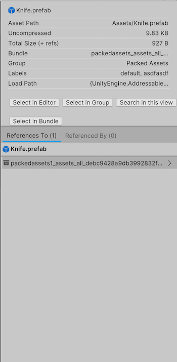
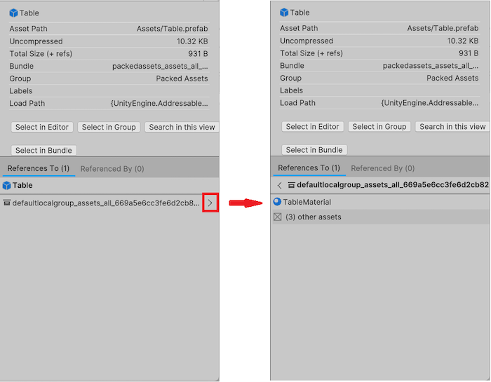

# Addressables Report Inspector reference

You can use the Inspector to view in depth information about any given asset or AssetBundle. When you select an asset or AssetBundle in [the Explore tab](AddressablesReportOverview.md#explore-tab) or [the Potential Issues tab](AddressablesReportPotentialIssuesTab.md) the Inspector panel displays information about the selected asset or AssetBundle.

The Inspector panel has the following sections:

* **Summary panel**: Displays information about an Asset or AssetBundle, such as its file size, its group, and any labels associated with it. Additionally, the summary panel has buttons that you can use to navigate to various places within both the Build Report and the Editor, depending on whether you select an Asset or an AssetBundle.
* **References panel**: Displays the chain of dependencies surrounding a given asset.

## Summary panel

Use the buttons in this panel to perform the following operations:

* **Select in Editor**: Selects the asset in the Unity Editor.
* **Select in Group**: Selects the asset in the Groups view in the Explore window. This navigates to the Groups view if you're not currently in it.
* **Select in Bundle**: Selects the asset in the AssetBundles view in the Explore window. This navigates to the AssetBundles view if you're not currently in it.
* **Search in this view**: Searches the name of the asset in the search bar.

## References panel

The References panel has the following tabs:

* **References To**: Contains a list of all the assets and AssetBundles that the selected item depends on. For example, if you have a material that references a shader, then the shader appears in this tab when you select the material in the Explore View.
* **Referenced By**: Contains a list of all the assets and AssetBundles that depend on the selected item. For example, if you have a material that references a shader, then the material that the shader references appears in this tab when you select the shader in the Explore View.

Select the arrow next to an Asset or AssetBundle in the References panel to cycle through the dependencies of the top level asset. For example, in the image above, `Table` has a reference to the bundle `defaultlocalgroup_assets_all`. Selecting the arrow shows that the asset that generates this dependency is `TableMaterial`, and that the `defaultlocalgroup_assets_all` bundle also contains three other assets that aren't dependencies of `Table`.

The question mark icon is displayed next to assets that aren't Addressable but are pulled into the bundle by another Addressable asset. Select it to highlight all the assets in the same bundle that reference that asset.
